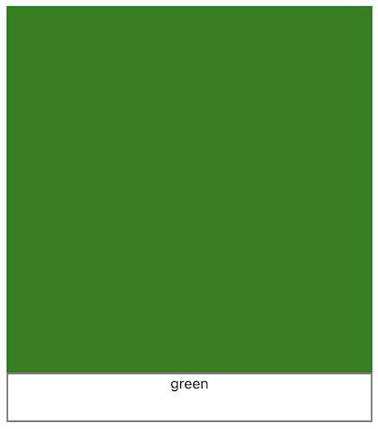

# HW 4 - React

### Introduction

One of the reasons the React framework is so powerful, is that instead of updating the the entire HTML website every time you change a component, you can simply just update that singular component, without having other parts of the website realize it! In this homework we will be using that notion and the idea of Components to create our own implementation of that.

We are going to be implementing a website very similar to Instagram, but much simpler... Let's call it Blockstagram. Blockstagram has 2 key features: 

1. It lets you post your very own special square block ranging from 4 colors (more if you're feeling ambitious)
2. It updates your main feed automatically, to whatever block was recently posted at the top of the screen.

[Blockstagram Demo Video](../assets/Assignment4/blockstagram_demo.mov)

### Learning Objectives

- Why use/learn React? - Objective #1
- Building familiarity with React syntax - Objective #2
- Knowledge of both class and functional components - Objective #3

## Setup

- [ ]  TODO: Insert how we’re going to have students pull starter code

## Q1 - HTML vs. React

Once setup, you’ll find two folders within your new repo named ‘html-example’ and ‘react-example’. Below are quick mockups of a social media user’s profile, on the left built with HTML and on the right with React. We encourage you to look at the different files and see how exactly you can condense code into re-usable components! 


### Answer on Gradescope: What’s another feature of a social media site you think should be made a component?

## Q2 - An Example of a Component: Menu

Your first task is to build out the Menu component for Blockstagram! This component should have a button for each color and clicking that button will automatically create a post with the corresponding color. For this task you will need to use state hooks and props.

- **Hint**
    
    The tricky part of this task is handling how to pass data from a child component back up to a parent component. Consider passing down a function as a prop.
    

```jsx
import { React } from 'react';

const Menu = () => { 

    return (
      <div className="colorOptions">
					{/* TODO */}
      </div>
    );
}

export default Menu;
```

## Q3 - Constructing the Blockstagram Feed and “Posts”

Now it’s time to build the rest of Blockstagram! Your task now is to create the Block component (aka an “instagram post”) and the Feed component. This might seem a little daunting at first, but let’s first break it down and just focus on what a “Block” will look like: We see it has a square filled with a color, and then a small outlined rectangle at the bottom representing where a caption may go.



1. Look at the ***Components/Block.js*** file and think about how you could use ***props*** as a way to pass in an attribute — What exactly is changing from block to block?
- Hint 1
    
    Consider using [inline styling](https://www.educative.io/answers/how-to-create-inline-styles-in-react) to assign the Block’s background color!
    

```jsx
import '../Styles/Block.css';

const Block = (props) => {
    /* YOUR CODE HERE */

    return (
        <div>
						{/* Refer to Hint 1 if stuck on coloring the posts */}
            <div className="post"></div>
            <div className="caption"></div>
        </div>
    );
}

export default Block;
```

1. Once you think you’ve completed Block (you can always go back and edit if necessary!), navigate to the ***Components/Feed.js*** file. You essentially have two tasks:
    1. Create a variable that keeps track of your posts/blocks
    2. Edit the `posts` variable to represent multiple `<Block/>` components
- Hint 2
    
    Consider the useState hook for the new state variable! Think of the state of the feed as a **LIST** of Block components, where every time you add a block the list updates with a new list of Block components :]
    

```jsx
import { useState } from 'react';

import Block from './Block';
import Menu from './Menu';

const Feed = () => {
    /* Declare a new state variable to keep track of the blocks on your Blockstagram feed! */
		// YOUR VAR HERE - Refer to Hint 2 for more help!

		/* Use the map() function to render multiple Blocks! */
		const posts = null; // EDIT THIS VAR

    return (
        <div>
            <Menu></Menu>

						{/* Below is where all of your Blocks should render! */}
            {posts}
        </div>
    );
}

export default Feed;
```

### Resources

Using Props: [https://reactjs.org/docs/components-and-props.html](https://reactjs.org/docs/components-and-props.html)

Inline Styles in React: [https://www.educative.io/answers/how-to-create-inline-styles-in-react](https://www.educative.io/answers/how-to-create-inline-styles-in-react)

UseState Hook: [https://reactjs.org/docs/hooks-state.html](https://reactjs.org/docs/hooks-state.html)

map() Function: [https://reactjs.org/docs/lists-and-keys.html](https://reactjs.org/docs/lists-and-keys.html)

## Q4 - Functional Components vs. Class Components

If you look at the Color component in `Color.js` you will notice that it looks different from the other components in this project. This is because the Color component is a Class Component, while the rest of the components are Functional Components. 

**Hint:** hint

```bash
import React from "react"

class Color extends React.Component {

    constructor(props) {
        super(props);
    }

    render() {
        return <button onClick={() => this.props.handleClick(this.props.color)}>Post {this.props.color}</button>
    }
}

export default Color;
```

### Conclusion

Try to leave the students with some closing thoughts, and feel free to [link](http://google.com) some resources for additional learning and help.

Students should be able to leave with the tools to start building their own websites!

**Contributors**
- [Nitya Krishnakumar](https://www.linkedin.com/in/nitya-krish/)
- [Abigail Delgado](https://www.linkedin.com/in/abigail-gee-delgado/)